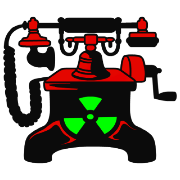

# Newk

> Weapon of Mass Decentralization

[](https://www.npmjs.com/package/newk)
[](https://gitlab.com/basedwon/newk/-/pipelines)
[](https://gitlab.com/basedwon/newk/-/blob/master/LICENSE)
[](https://www.npmjs.com/package/newk) 

[](https://gitlab.com/basedwon/newk)
[](https://github.com/basedwon/newk)
[](https://twitter.com/basdwon)
[](https://discordapp.com/users/basedwon)

A JS library that provides a flexible, transport-layer abstraction for various network protocols. By utilizing a base transport class, `newk` allows for easy extension and customization of network communication patterns. It comes with an NKN (New Kind of Network) transport implementation and supports message routing, publish/subscribe patterns, and basic message handling.

## Features

- Transport-layer abstraction with a base class for easy extension.
- Built-in NKN transport implementation for decentralized communication.
- Support for Pub/Sub mechanisms.
- Extendable with various decorators for additional functionality.
- Straightforward message routing.

## Installation

```bash
npm install newk
```

## Usage

Import the `Newk` class mixin from the package:

```js
import Newk from 'newk'
```
or
```js
const Newk = require('newk')
```

### Initializing Newk

```javascript
// Initialize with options
const options = {
  identifier: 'your-identifier',
  transport: 'bus', // or 'nkn'
  decorators: ['pubsub', 'encryption'],
  // ... other options
}
const newk = await Newk.init(options, transportType)
```

### Adding Routes

```javascript
newk.addRoute('action', handlerFunction)
newk.addRoutes(anObjectContainingMethods) // each method that starts with `on` is route
```

### Sending and Dispatching Messages

```javascript
await newk.send(destination, payload, options)
await newk.dispatch(destination, messageType, data, options)
```

### Subscription and Publishing

```javascript
await newk.subscribe(topic, metadata)
await newk.unsubscribe(topic)
await newk.publish(topic, payload)
await newk.broadcast(topic, messageType, data, options, excludeSelf)
```

### Getting Subscribers

```javascript
await newk.getSubscribers(topic, metadata)
await newk.discover(topic, metadata, ...)
```

### Handling Messages

The `onMessage` method is used to handle incoming messages:

```javascript
newk.onMessage((message) => {
  // Handle the message
})
```

### Connection Handling with NknConnect

To manage connections with `NknConnect`:

```javascript
const nknConnect = await NknConnect.init(options)
```

You can use `onMessage`, `onConnect`, and `onWsError` methods to handle different connection events.

## Documentation

- [API Reference](/docs/api.md)

### API

- `BaseTransport`: Abstract base class for all transports.
- `NknTransport`: NKN transport implementation.
- `Newk`: Main class to interact with the transport layer.

## Tests

In order to run the test suite, simply clone the repository and install its dependencies:

```bash
git clone https://gitlab.com/basedwon/newk.git
cd newk
npm install
```

To run the tests:

```bash
npm test
```

## Contributing

Thank you! Please see our [contributing guidelines](/docs/contributing.md) for details.

## Donations

If you find this project useful and want to help support further development, please send us some coin. We greatly appreciate any and all contributions. Thank you!

**Bitcoin (BTC):**
```
1JUb1yNFH6wjGekRUW6Dfgyg4J4h6wKKdF
```

**Monero (XMR):**
```
46uV2fMZT3EWkBrGUgszJCcbqFqEvqrB4bZBJwsbx7yA8e2WBakXzJSUK8aqT4GoqERzbg4oKT2SiPeCgjzVH6VpSQ5y7KQ
```

## License

Newk is [MIT licensed](https://gitlab.com/basedwon/newk/-/blob/master/LICENSE).
